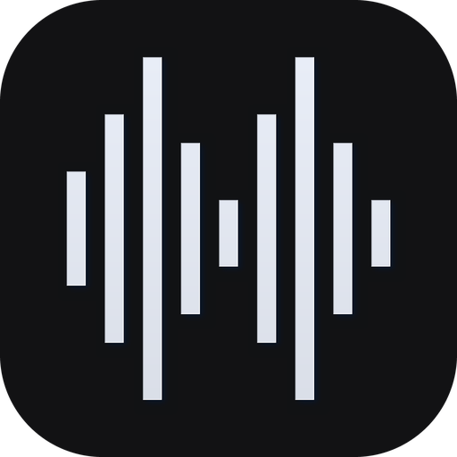
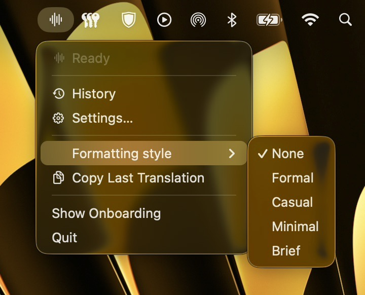
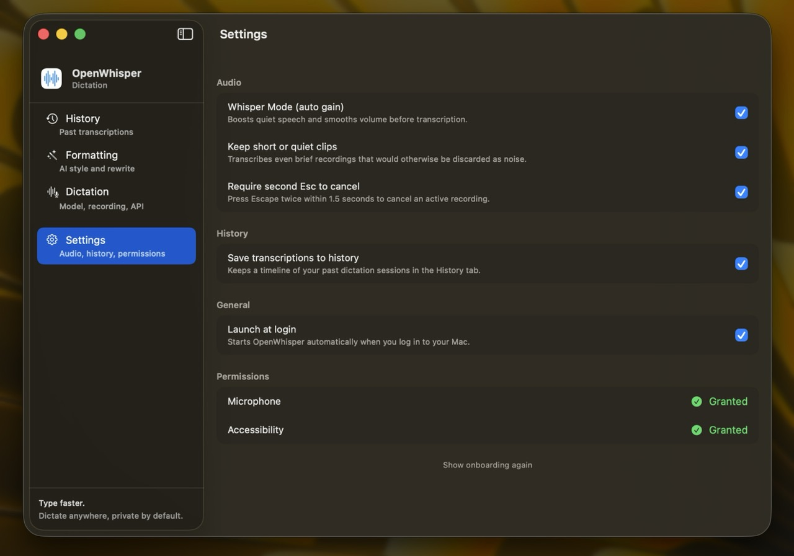
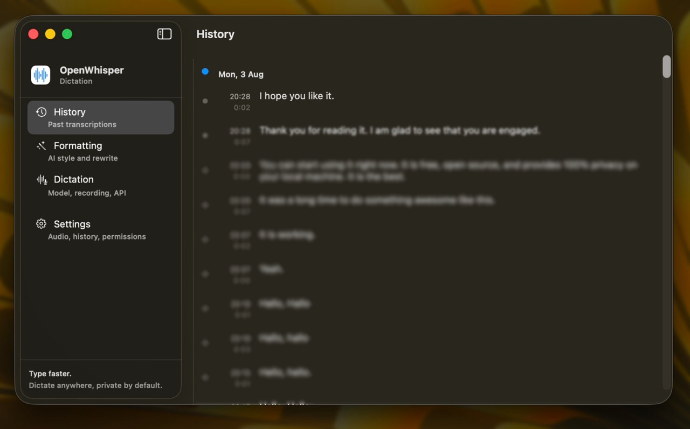
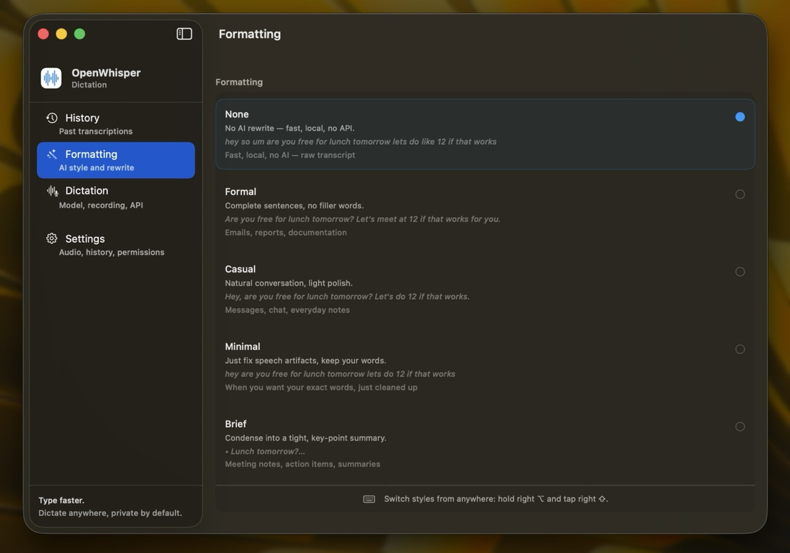
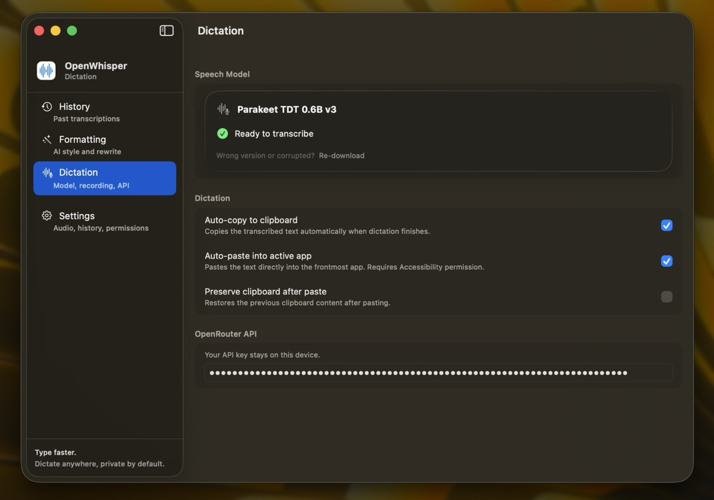

<p align="center">
  
</p>

<h1 align="center">OpenWhisper</h1>

<p align="center">
  <strong>Dictate anywhere, type faster.</strong> Private speech-to-text for **macOS** and **iPhone** — fully on-device, open source.<br>
  Hold the hotkey, speak, release — your words appear at the cursor. Everything runs on your own hardware:<br>
  no cloud, no account, no audio ever leaves your device.
</p>

<p align="center">Powered by <a href="https://huggingface.co/nvidia/parakeet-tdt-0.6b-v3">Parakeet TDT 0.6B v3</a> on Apple Silicon.</p>

---

## Demos

### macOS — dictation & formatting

<p align="center">
  <table>
    <tr>
      <td align="center" width="50%">
        
        <br><em>Hold right ⌘+⌥, speak, release — glass overlay with a live waveform, then "Copied".</em>
      </td>
      <td align="center" width="50%">
        
        <br><em>Hold right ⌥ and tap right ⇧ — the overlay cycles formatting styles with a green checkmark.</em>
      </td>
    </tr>
  </table>
</p>

### macOS — menu bar

<p align="center">
  
</p>

Lives in the menu bar — style picker, copy last transcription, history and settings one click away.

### macOS — main window

<p align="center">
  <table>
    <tr>
      <td align="center" width="50%">
        
        <br><em>Settings — audio, history, permissions, launch at login.</em>
      </td>
      <td align="center" width="50%">
        
        <br><em>History — every transcription grouped by day, tap to copy.</em>
      </td>
    </tr>
    <tr>
      <td align="center" width="50%">
        
        <br><em>Formatting — pick a rewrite style, or None for a fast, local transcript.</em>
      </td>
      <td align="center" width="50%">
        
        <br><em>Dictation — speech model, auto-copy/paste, OpenRouter API key.</em>
      </td>
    </tr>
  </table>
</p>

### iOS

iOS demos coming soon.

---

## Features

### macOS (primary)

- **Menu-bar app** — lives in the menu bar, one click away, no Dock clutter
- **Global hotkey dictation** — hold right **⌘+⌥** anywhere, speak, release
- **Glass status overlay** — shows the target app icon, a **live audio waveform** and per-phase status (listening → transcribing → polished → copied), with subtle animations
- **Auto-paste** — inserts the result into the frontmost app (Accessibility); auto-copy to clipboard too
- **AI text polish** — optional OpenRouter-powered rewrite in 4 styles: Formal, Casual, Minimal, Brief
- **Audio ducking** — gently lowers system volume while recording, restores after
- **Timeline history** — every transcription saved, grouped by day, tap to copy
- **Launch at login** — optional auto-start (Settings → General)
- **25 European languages**, punctuation and number normalization built in

### iOS

- **On-device voice-to-text** with selectable compute units (GPU / CPU)
- **3-step onboarding**: intro, one-time model download, privacy promise
- **Transcription history**: tap to copy, delete
- **Auto-copy** to clipboard after each transcription
- One-time **~480 MB model download** (~1.3 GB free space), then fully offline; subsequent starts ~0.2 s

### Shelved (code kept, may return)

- **Keyboard extension** — full QWERTY keyboard + dictation inside any text field
- **Live Activities** — dictation progress on the lock screen / Dynamic Island

---

## Tech stack

| | |
|---|---|
| UI | SwiftUI |
| Minimum OS | macOS 26 · iOS 18+ |
| Speech model (macOS) | [Parakeet TDT 0.6B v3](https://huggingface.co/nvidia/parakeet-tdt-0.6b-v3) via [FluidAudio](https://github.com/FluidInference/FluidAudio) |
| Speech model (iOS) | Parakeet TDT 0.6B v3 → [Core ML](https://huggingface.co/mweinbach1/parakeet-tdt-0.6b-v3-coreml) via [parakeet-coreml-ios](https://github.com/pisze-programy/parakeet-coreml-ios) (vendored at `Packages/`) |
| AI formatting | [OpenRouter](https://openrouter.ai) (optional, needs API key) |
| Persistence | SwiftData, local-only |
| Shared code | `OpenWhisperShared` Swift package — prompts, punctuation, number normalization, STT orchestration, shared UI components |

---

## Project structure

```
openWhisperMac/        macOS app (menu bar, overlay, dictation pipeline)
openWhisper/           iOS app (on-device dictation, onboarding, history)
OpenWhisperShared/     shared Swift package (logic + UI used by both platforms)
OpenWhisperKeyboard/   keyboard extension — shelved
Packages/              vendored parakeet-coreml-ios
scripts/make-dmg.sh    one-command Release build → DMG for macOS
```

---

## Getting started

### macOS

1. Open `openWhisper.xcodeproj` in Xcode.
2. Run the `openWhisperMac` scheme (or build a DMG with `./scripts/make-dmg.sh`).
3. Complete onboarding: grant Microphone + Accessibility, download the model (~460 MB).
4. Hold right **⌘+⌥**, speak, release. Optionally add your OpenRouter key in Settings for AI polish.

### iOS

1. Open `openWhisper.xcodeproj` in Xcode.
2. Run on a physical iPhone (iOS 18+).
3. The model downloads on first launch (~480 MB, ~1.3 GB free space recommended).

---

## Roadmap

- **macOS 1.0** — core dictation loop, overlay, history, settings, DMG distribution
- **Keyboard extension** (maybe) — bring back shelved extension for dictate-anywhere on iPhone
- **App Store release** — macOS (and iOS) with free on-device core

Details and decisions live in [PLAN.md](PLAN.md) and [PLAN_MACOS.md](PLAN_MACOS.md).

---

## Support

OpenWhisper is free and open source. If it saves you time:

- star the repo, and/or
- sponsor the project (GitHub Sponsors)

---

## License & attribution

- App source code: Apache-2.0
- `parakeet-coreml-ios`: Apache-2.0 — [pisze-programy/parakeet-coreml-ios](https://github.com/pisze-programy/parakeet-coreml-ios) (our fork of `parakeet-coreml-swift`, faster, improved and tested)
- Model weights: CC-BY-4.0 — NVIDIA Parakeet TDT 0.6B v3
